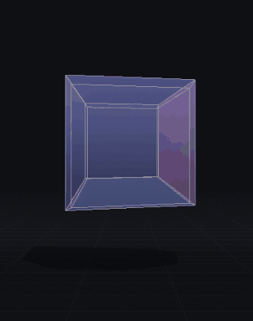

<!-- La GIF va nei primi 400 pixel: è l'ombra dell'ombra mentre l'oggetto si rovescia. -->


# Non puoi vedere la quarta dimensione. Puoi riconoscerla.

### ▶ [Gioca ora](https://dade1987.github.io/fourth-person/)

**Nessun occhiale, nessuna app, nessun permesso. Apri il link e inclina il telefono.**

[](https://github.com/dade1987/fourth-person/actions/workflows/test.yml)
[](https://github.com/dade1987/fourth-person/actions/workflows/deploy.yml)

---

## Cos'è

Un gioco nel browser in cui **abiti** uno spazio a quattro dimensioni. Si apre da un
link sul telefono, funziona offline, e ti porta dalla prospettiva del disegno fino
alla quarta dimensione parlandoti in lingua semplice, un gradino alla volta.

Non è un visualizzatore di tesseratti. Di quelli il mondo ne ha abbastanza.

## Cosa lo distingue

- **Ti insegna.** Sette capitoli narrati — *la Scala* — che rifanno la strada del
  capire. Ognuno si chiude con un'azione che compi tu: nessun capitolo avanza da solo.
- **Si vede in profondità senza occhiali.** Prospettiva accoppiata alla testa con
  frustum asimmetrico fuori asse (Kooima 2008) e oscillazione autonoma quando il
  telefono è fermo. Niente anaglifo: il colore serve a codificare la quarta direzione.
- **Le celle sono di vetro.** Il reticolo di fili è onesto e illeggibile, il solido
  opaco nasconde sette celle su otto. Il vetro dà superfici a verso univoco *e* lascia
  vedere attraverso — con la rifrazione che varia con `w`, non uniforme.
- **L'ombra dell'ombra.** Il tesseratto proiettato in 3D sta nella stanza e proietta a
  sua volta un'ombra sul pavimento. Shadow map ordinaria: l'ombra è vera.
- **Si sente.** Un bordone la cui altezza segue la tua posizione in `w`.
- **Si condivide.** Dopo ogni momento wow il gioco registra da solo sei secondi e li
  offre con un tocco.

## Le proprietà matematiche implementate

Sono nel codice, in `src/math4d/`, che non importa nulla dal rendering ed è testabile
in Node senza browser. Ognuna è verificata dai test — vedi [FONTI.md](FONTI.md) per i
riferimenti.

| | |
|---|---|
| In 4D non esiste un asse di rotazione | si ruota in un **piano**: `SO(4)` ha dimensione 6 |
| Rotazioni doppie e isocline | due velocità angolari distinte, nessun punto fisso |
| Momento angolare | un **bivettore**: sei componenti, non tre |
| Gradi di libertà di `SE(4)` | **dieci**, e i controlli li danno tutti |
| Niente prodotto vettoriale | la normale a un iperpiano viene da **tre** vettori: `n = ⋆(a ∧ b ∧ c)` |
| Il bordo di un solido è un volume | occludere = togliere **celle 3D** |
| Caduta cubica | luce e gravità vanno come `1/r³` → **nessuna orbita circolare stabile** |
| I nodi si sciolgono | il trifoglio si slega, i due anelli si separano |
| "Chiuso" non significa niente | un guscio 3D non racchiude nulla; solo l'ipersfera tiene |
| Chiralità | 180° in un piano con `w` riporta l'oggetto **specchiato** |
| I politopi regolari sono sei | generati da codice, conteggi verificati — 24-cella inclusa |

## Girarlo in locale

```sh
git clone https://github.com/dade1987/fourth-person.git && cd fourth-person
npm test          # la matematica, gli invarianti, la percezione (nessuna dipendenza)
npm run serve     # poi apri http://localhost:8080
```

I test end-to-end (`npm run test:e2e`) vogliono Playwright: `npm i -D @playwright/test && npx playwright install chromium`.

## Come contribuire

**Aggiungere una lingua è il contributo più utile, e costa un file solo.** Copia
`src/i18n/it.json`, traduci, aggiungi il codice all'elenco: le istruzioni per esteso
sono in [CONTRIBUTING.md](CONTRIBUTING.md). La Scala è fatta per essere letta ad alta
voce — se vuoi prestarle la tua voce, apri una issue.

## Licenze e crediti

Codice: [MIT](LICENSE). Testi, traduzioni e contenuti: [CC BY 4.0](LICENSE-CONTENT).

Questo progetto esiste perché altri sono arrivati prima: **Miegakure** e **4D Toys**
di Marc ten Bosch, **4D Golf** di CodeParade. Se la quarta dimensione ti ha preso,
vanno giocati.

La specifica completa che ha guidato la costruzione è in [SPEC.md](SPEC.md), e non è
un documento di marketing: contiene anche l'elenco di ciò che il gioco **non** fa.
